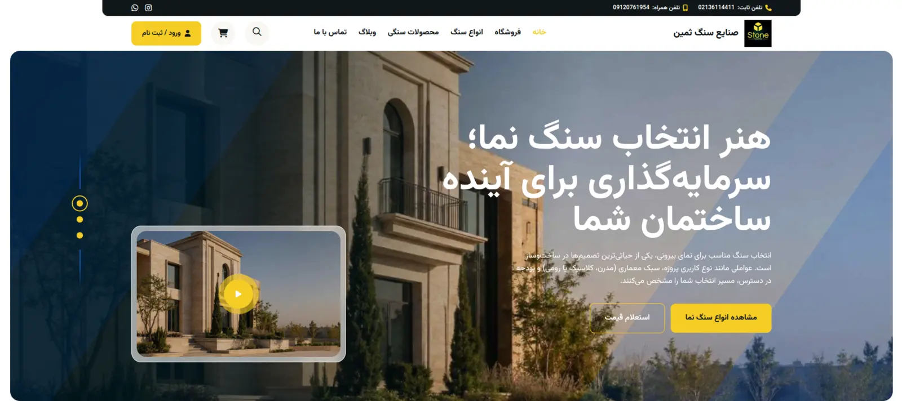
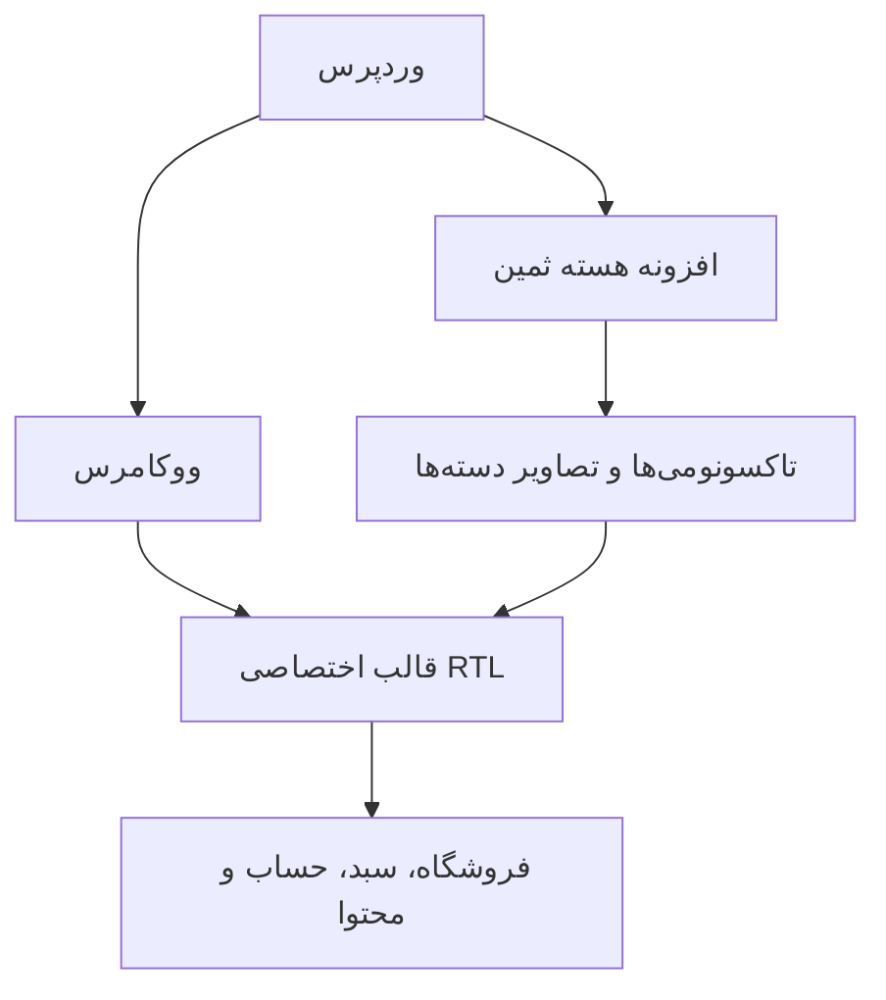
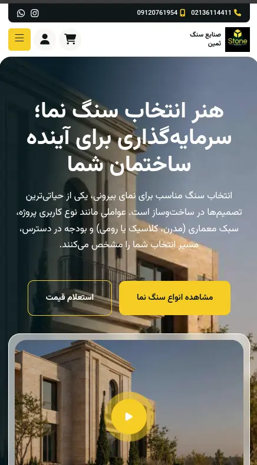
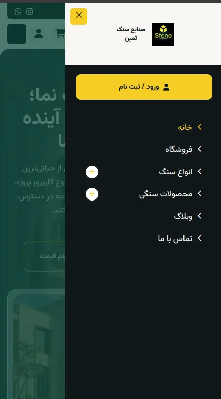
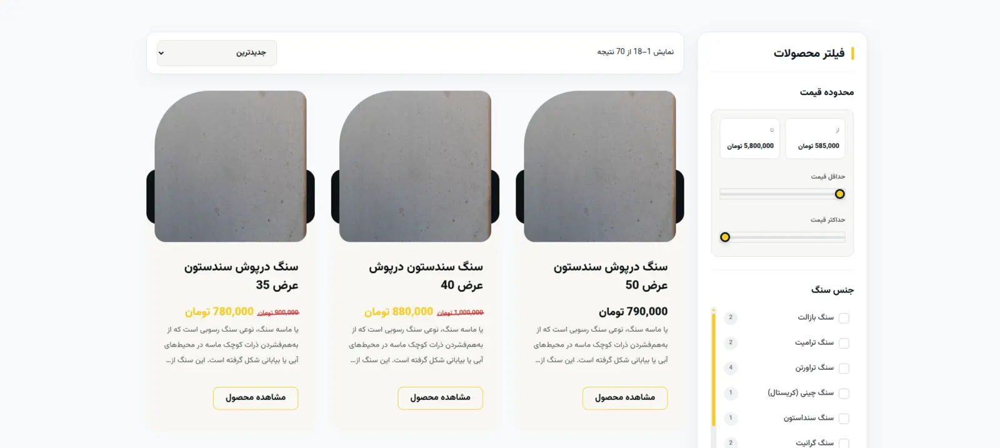
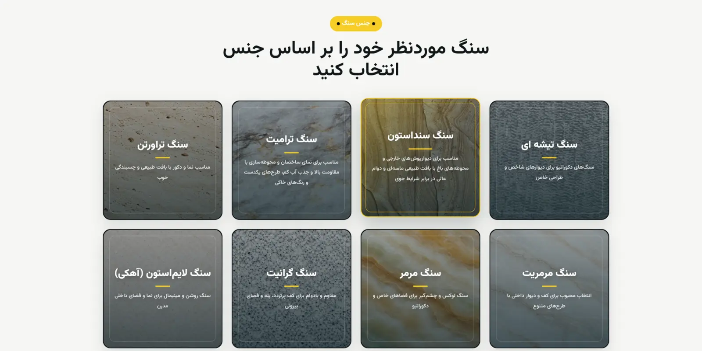
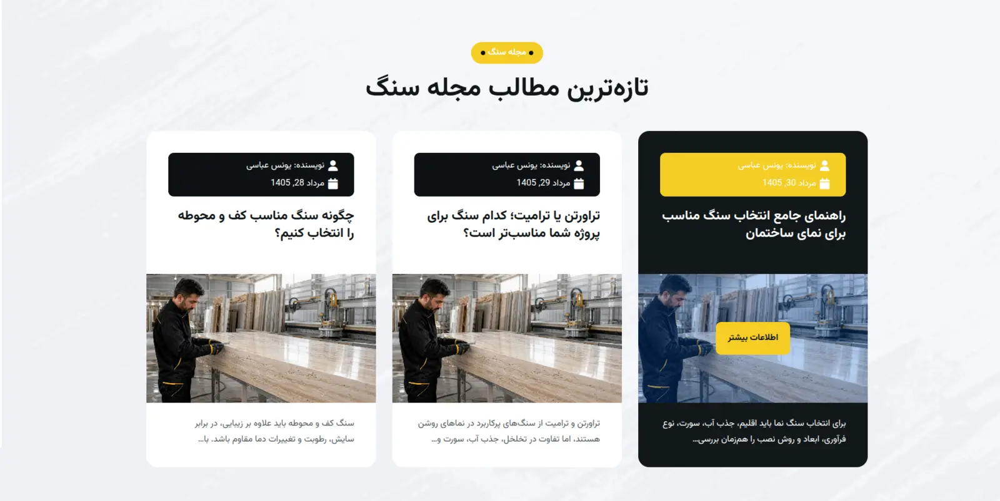

# کیس استادی فروشگاه ووکامرسی صنایع سنگ ثمین

[English version](README.md)

> این مخزن، نسخه عمومی و مستندشده یک پروژه خصوصی وردپرس و ووکامرس است. محتوای آن شامل توضیحات فنی، تصاویر و تعداد محدودی نمونه‌کد منتخب است و به‌عنوان قالب قابل نصب ارائه نشده است.

## معرفی پروژه

صنایع سنگ ثمین یک فروشگاه فارسی و راست‌چین برای معرفی، دسته‌بندی و سفارش سنگ‌های ساختمانی و مصنوعات سنگی است. پروژه از یک قالب اختصاصی وردپرس و یک افزونه هسته مستقل تشکیل شده تا داده‌های تخصصی کاتالوگ از لایه نمایش جدا بمانند.

این پروژه فقط استایل‌دهی یک قالب آماده نیست. ساختارهای تخصصی محصولات سنگی، فیلترهای فروشگاه، واحد سفارش محصول، سبد خرید ایجکسی، جستجوی اختصاصی محصولات و صفحات واکنش‌گرای ووکامرس در آن پیاده‌سازی شده‌اند.

| مورد | توضیح |
| --- | --- |
| نوع پروژه | فروشگاه اختصاصی وردپرس و ووکامرس با رابط RTL |
| مسئولیت‌ها | توسعه قالب، سفارشی‌سازی ووکامرس، رابط واکنش‌گرا و افزونه تخصصی پروژه |
| زبان اصلی رابط | فارسی |
| مخزن کد کامل | خصوصی |
| این مخزن | کیس استادی عمومی و نمونه‌کدهای منتخب |
| وب‌سایت اصلی پروژه | [stonesamin.ir](https://stonesamin.ir/) |
| صفحه پروژه در پورتفولیو | [مشاهده کیس استادی](https://younesabbasi.com/portfolio/samin-stone/) |
| وضعیت | پروژه در حال توسعه، مستندشده بر اساس آخرین کامیت بررسی‌شده |

## مهم‌ترین قابلیت‌ها

- افزونه ماژولار برای تعریف تاکسونومی «جنس سنگ» و «کاربرد سنگ».
- مدیریت تصویر تاکسونومی‌ها با Media Library وردپرس و کنترل امنیتی Nonce.
- کارت محصول قابل استفاده مجدد و اسلایدرهای محصولات صفحه اصلی.
- آرشیو سه‌ستونه محصولات در دسکتاپ و فیلتر کشویی در موبایل.
- ارتباط `OR` میان فیلترهای جنس، کاربرد و دسته‌بندی محصول.
- فیلتر بازه قیمت که در حالت پیش‌فرض روی نتایج اثر نمی‌گذارد.
- تعیین واحد فروش هر محصول: متر مربع، متر طول یا عدد.
- انتقال واحد محصول به سبد خرید و آیتم نهایی سفارش.
- سایدبار سبد خرید ایجکسی همراه با شمارنده، اعلان و مدیریت Focus.
- یکسان‌سازی نمایش قیمت، جداکننده هزارگان و حذف اعشار غیرضروری.
- محدودکردن جستجو به محصولات و حفظ عبارت جستجو هنگام فیلترکردن.
- طراحی اختصاصی صفحات محصول، فروشگاه، سبد خرید، حساب کاربری و محتوای وبلاگ.
- نگهداری فونت‌ها و دارایی‌های رابط در داخل پروژه و حذف وابستگی به CDN خارجی.

## معماری کلی

افزونه هسته مسئول داده‌ها و منطق دامنه کاتالوگ است. قالب، نمایش، تعاملات رابط و اتصال به ووکامرس را مدیریت می‌کند. توضیحات کامل‌تر در [مستند معماری](docs/architecture.md) آمده است.

## تصاویر منتخب

### صفحه اصلی و منوی موبایل

  
  

### فروشگاه و دسته‌بندی جنس سنگ

### وبلاگ

## نمونه‌کدها

پوشه [`code-samples`](code-samples/README.md) فقط قسمت‌های منتخب پروژه را نمایش می‌دهد. مهم‌ترین نمونه‌ها عبارت‌اند از:

- معماری ماژولار افزونه هسته؛
- تاکسونومی‌های تخصصی محصول و مدیریت تصویر آن‌ها؛
- منطق فیلتر محصولات و سایدبار فیلتر موبایل؛
- سبد خرید ایجکسی و WooCommerce fragments؛
- واحد اختصاصی فروش محصول و انتقال آن به سفارش؛
- اسلایدر قابل استفاده مجدد محصولات؛
- فرم جستجوی محدودشده به محصولات.

## فناوری‌ها

- PHP و Hookهای وردپرس
- APIها و Templateهای ووکامرس
- PHP شی‌گرا برای افزونه هسته
- JavaScript و رویدادهای jQuery ووکامرس
- HTML5، CSS3، Bootstrap و طراحی واکنش‌گرای RTL
- Swiper
- Git و GitHub

## محدوده مخزن عمومی

این موارد عمداً منتشر نشده‌اند:

- قالب و افزونه کامل و قابل نصب؛
- تاریخچه Git مخزن خصوصی؛
- تنظیمات محیط توسعه و اطلاعات آزمایشی؛
- تصاویر اصلی محصولات، ویدئوها، فونت‌ها و فایل‌های برند؛
- کتابخانه‌های شخص ثالث و فایل‌های دارای لایسنس؛
- تصاویر مربوط به خطاها یا بخش‌های ناتمام.

برای اطلاعات مالکیت و نحوه استفاده، [NOTICE.md](NOTICE.md) را ببینید.

## لینک‌های پروژه

- [مشاهده وب‌سایت صنایع سنگ ثمین](https://stonesamin.ir/)
- [مطالعه کیس استادی کامل در پورتفولیوی من](https://younesabbasi.com/portfolio/samin-stone/)

## توسعه‌دهنده

این پروژه و کیس استادی توسط [@younesabbasi1991](https://github.com/younesabbasi1991) نگهداری می‌شود.
