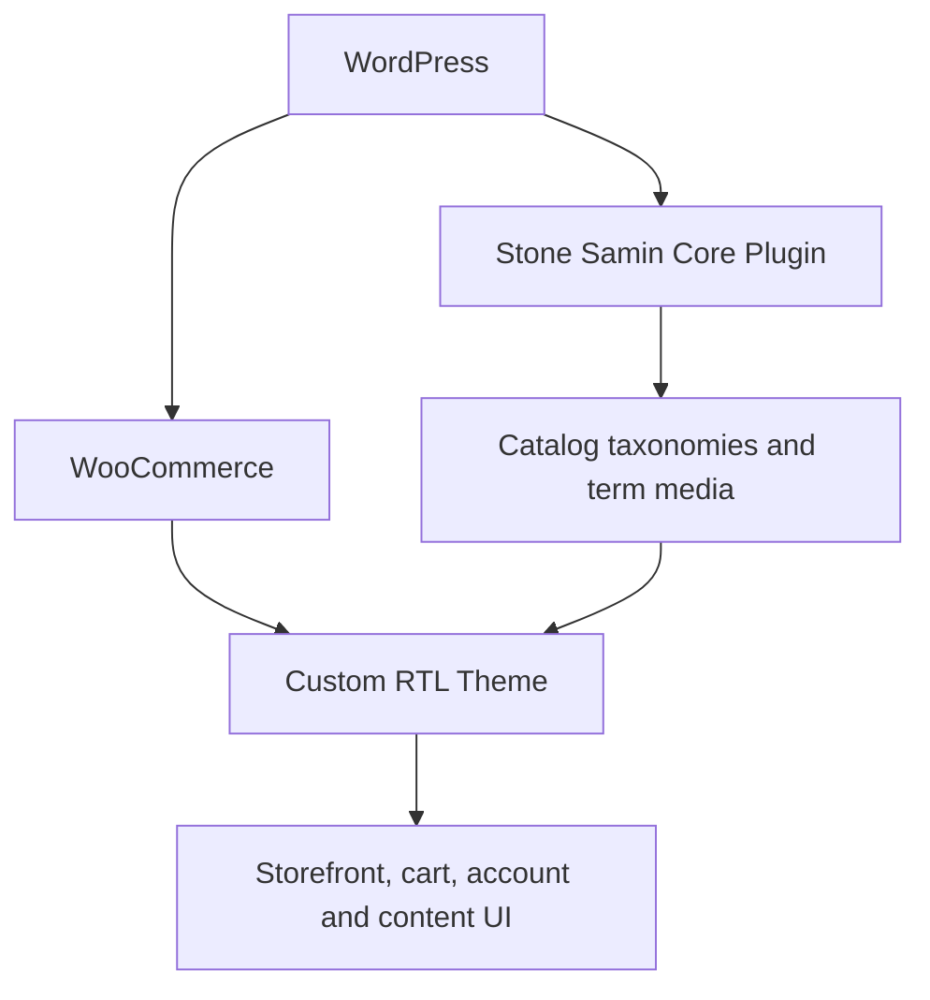

# Samin Stone — Custom WooCommerce Case Study

[نسخه فارسی](README.fa.md)

> A public engineering case study for a private WordPress and WooCommerce project. This repository contains documentation, screenshots, and a small set of curated source-code samples. It is not the complete theme and cannot be installed as a WordPress package.

## Project overview

Samin Stone is a Persian, right-to-left WooCommerce storefront for browsing and ordering natural building stone and fabricated stone products. The project combines a custom WordPress theme with a small domain-focused core plugin so that catalog data remains separate from presentation.

The implementation goes beyond visual theming. It introduces stone-specific catalog structures, reusable product components, archive filtering, product measurement units, AJAX cart interactions, product-only search, responsive navigation, and tailored WooCommerce account and checkout experiences.

| Item | Details |
| --- | --- |
| Project type | Custom RTL WordPress and WooCommerce storefront |
| Responsibility | Theme engineering, WooCommerce customization, responsive UI, and domain plugin development |
| Primary language | Persian (RTL) |
| Source repository | Private |
| This repository | Public case study and selected code samples |
| Status | Ongoing project documented from the latest reviewed private commit |

## Key outcomes

- Built a modular custom plugin for stone material and stone usage taxonomies.
- Added secure taxonomy-thumbnail management through the WordPress Media Library.
- Created reusable product cards and Swiper-powered homepage product carousels.
- Built a three-column desktop product archive with responsive mobile filtering.
- Implemented taxonomy filtering with an `OR` relationship across catalog dimensions.
- Added an optional dual-range price filter that does not affect results at its default bounds.
- Added product measurement units: square metre, linear metre, and piece.
- Persisted the selected product unit from product metadata into cart and order line items.
- Built an accessible AJAX mini-cart drawer that refreshes fragments and the cart-count badge.
- Standardized RTL price formatting, thousands separators, and zero-decimal prices.
- Limited the global search interface to WooCommerce products while preserving archive filters.
- Customized cart, checkout, account, product, blog, and content layouts for RTL use.
- Hosted fonts and interface assets locally instead of depending on external CDNs.

## High-level architecture

The core plugin owns reusable catalog-domain data. The theme owns templates, presentation, page-level interactions, and WooCommerce integration. More detail is available in [Architecture](docs/architecture.md).

## Selected screens

### Responsive homepage and navigation

  
  

### Storefront discovery

### Editorial experience

## Representative code

The [`code-samples`](code-samples/README.md) directory contains selected implementation files rather than a distributable copy of the private project.

| Area | Sample |
| --- | --- |
| Modular plugin bootstrapping | [`Plugin.php`](code-samples/custom-core-plugin/Plugin.php) |
| Domain taxonomies | [`ProductTaxonomyModule.php`](code-samples/custom-core-plugin/ProductTaxonomyModule.php) |
| Taxonomy media administration | [`ProductTaxonomyThumbnailModule.php`](code-samples/custom-core-plugin/ProductTaxonomyThumbnailModule.php) |
| Catalog filters | [`product-filter.php`](code-samples/product-filtering/product-filter.php) |
| Responsive filter interactions | [`product-filter.js`](code-samples/product-filtering/product-filter.js) |
| AJAX cart fragments | [`cart-sidebar.php`](code-samples/ajax-cart-sidebar/cart-sidebar.php) |
| Accessible cart drawer | [`cart-sidebar.js`](code-samples/ajax-cart-sidebar/cart-sidebar.js) |
| Product measurement units | [`product-unit.php`](code-samples/product-unit/product-unit.php) |
| Reusable product carousel | [`product-carousel.php`](code-samples/product-carousel/product-carousel.php) |
| Product-only search | [`product-search-form.php`](code-samples/product-search/product-search-form.php) |

## Technology

- PHP and WordPress hooks
- WooCommerce templates, product APIs, cart fragments, and order item metadata
- Object-oriented PHP for the custom core plugin
- JavaScript and jQuery event integration
- HTML5, CSS3, Bootstrap grid utilities, and responsive RTL design
- Swiper for reusable product carousels
- Git and GitHub

## Engineering documentation

- [Architecture and data flow](docs/architecture.md)
- [Feature inventory](docs/features.md)
- [Challenges and solutions](docs/challenges-and-solutions.md)

## Repository scope

The complete private repository contains hundreds of theme, plugin, asset, and template files. This public repository intentionally excludes:

- the installable theme and full custom plugin;
- private Git history and environment configuration;
- customer, account, and test data;
- original product media, videos, fonts, and branding source files;
- bundled third-party libraries and licensed assets;
- unfinished or diagnostic screenshots.

See [NOTICE.md](NOTICE.md) for usage and ownership information.

## Author

Project and case study maintained by [@younesabbasi1991](https://github.com/younesabbasi1991).
