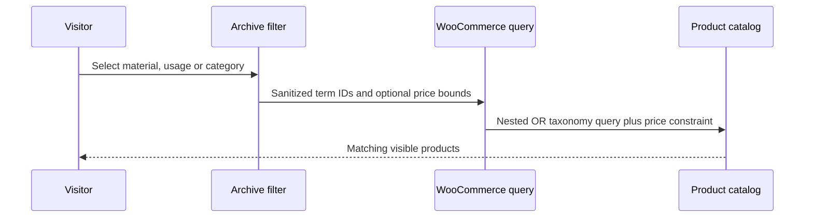
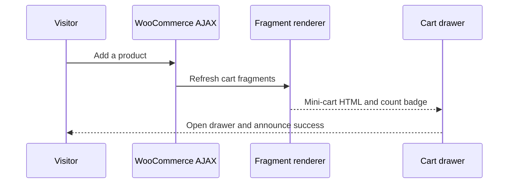
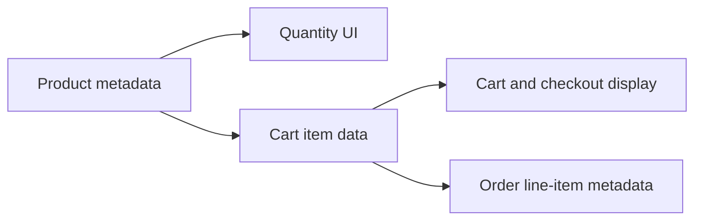

# Architecture and data flow

## Separation of responsibilities

The private project uses two application layers on top of WordPress and WooCommerce:

| Layer | Responsibility |
| --- | --- |
| Stone Samin Core plugin | Domain taxonomies, term metadata, administration fields, and reusable catalog behavior |
| Custom Stone Samin theme | Templates, styling, component rendering, WooCommerce hooks, and browser interactions |

Keeping the stone catalog model in a plugin prevents business data from disappearing when the presentation layer changes. The theme consumes that data without owning its registration.

## Core-plugin boot sequence

The plugin exposes a small `ModuleInterface`. The main plugin object boots once, creates each module, and calls its `register()` method. Individual modules attach their own WordPress hooks.

This structure keeps taxonomy registration and taxonomy-thumbnail administration isolated and makes additional domain modules straightforward to add.

## Catalog model

WooCommerce product categories are retained for the commercial catalog. Two additional hierarchical taxonomies represent stone-specific dimensions:

- `ss_stone_material` — what the stone is made of, such as travertine or granite;
- `ss_stone_usage` — where or how the stone is used, such as facade, flooring, or stairs.

Both taxonomies are public, REST-enabled, available in navigation menus, and use WooCommerce product-term capabilities.

## Product filtering flow

The filter deliberately groups catalog taxonomies with `OR`. A product can therefore match the selected material, usage, or WooCommerce category. The optional price constraint remains independent. Empty values and the unchanged full price range are removed before WooCommerce builds its query.

On smaller screens, JavaScript converts the filter panel into an off-canvas drawer. It synchronizes `aria-hidden`, `aria-expanded`, and `inert`, supports Escape and overlay dismissal, and restores focus to the trigger.

## AJAX cart flow

WooCommerce fragments refresh both the mini-cart content and the badge beside every cart trigger. The drawer listens for WooCommerce add/remove events, opens after a successful addition, displays transient notices, locks background scrolling, traps keyboard focus, and restores focus when closed.

## Product-unit lifecycle

An administrator selects square metre, linear metre, or piece in the product editor. Square metre is the fallback. Variations inherit the parent value when they do not define one. The resolved unit appears beside quantity controls and is persisted through cart and order creation.

## Product search

The search form submits the standard WordPress `s` parameter together with `post_type=product`. Product-search result pages reuse the WooCommerce archive presentation. Hidden form fields preserve the search query while visitors apply or reset catalog filters.

## Asset loading

Theme assets are enqueued only where required. Product archive assets also load for product-search results, while single-product, cart, checkout, and account styles remain scoped to their respective screens. Fonts and UI libraries are served locally to avoid runtime CDN dependencies.

